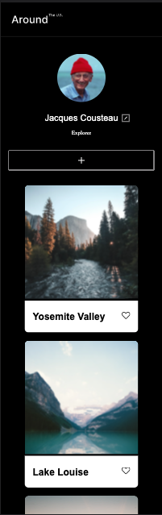
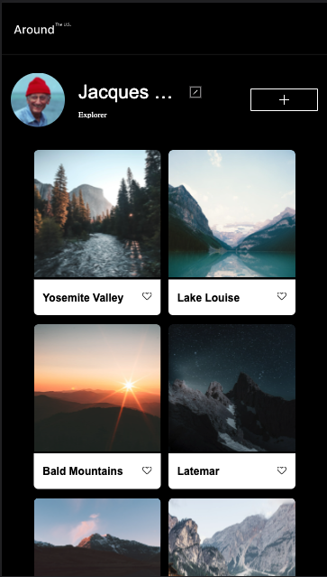
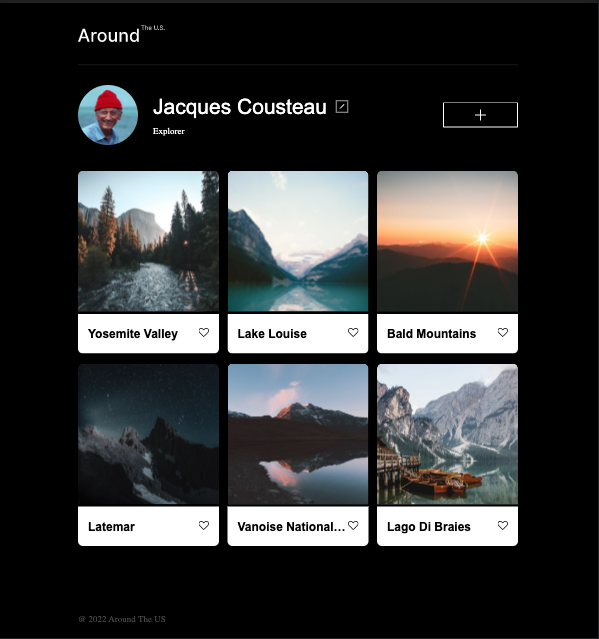

# Project 3: Around The U.S.

### Overview

- Intro
- Figma
- Images

**Intro**

This Project uses flexbox and Grid to create a responsive and easy on the eyes site. The site allows a user to enter a name, profile picture and add posts as well. There is also an interactive like button under each picture for other users with an account to "like" someone elses pictures!

Github Pages Link

https://ckbailar7.github.io/se_project_aroundtheus/

\*\*\*Images

